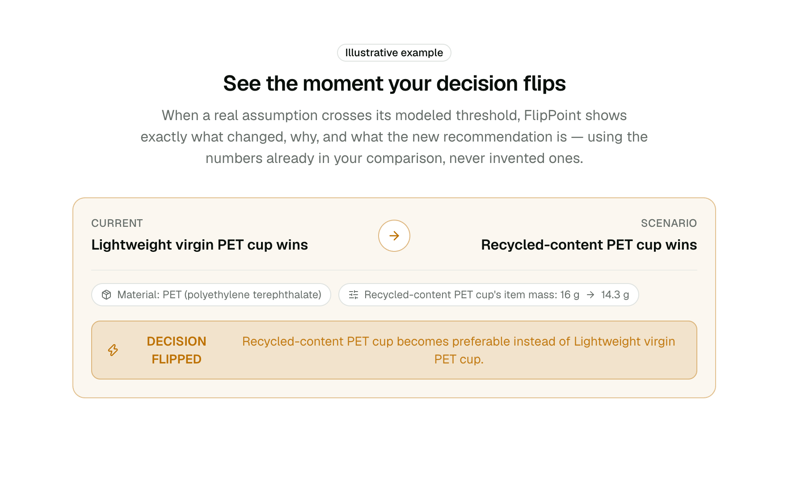

# FlipPoint

> An environmental decision copilot built for **NextStep Hacks 2026**.

[](https://flippoint-ivory.vercel.app/)
[](https://github.com/singhakousik363-del/flippoint/actions/workflows/test.yml)
[](LICENSE)

**🔗 Live Demo:** https://flippoint-ivory.vercel.app/



---

## What FlipPoint does

Choosing between packaging options (virgin plastic vs. recycled content, single-use vs.
reusable, one supplier's freight lane vs. another) usually comes down to a gut call, because
running the numbers by hand is tedious and the "right" answer is often close enough to flip
under slightly different assumptions.

**FlipPoint compares 2–4 packaging options through a deterministic, source-cited calculation
engine and tells you exactly which assumption would have to change to flip the recommendation** —
instead of just handing you a single number and hoping you trust it.

- **Deterministic engine** — production, transport, and disposal impact are computed the same
  way every time, from a small library of cited emission factors. No randomness, no guessing.
- **Sensitivity analysis & break-even** — ranks every input assumption by how much it could move
  the outcome, and solves for the exact break-even point where the recommended option changes.
- **What-if simulator** — drag a slider (volume, transport distance, recycled content, …) and
  watch the recommendation update live, driven by the same engine.
- **AI explains, never calculates** — a language model narrates the deterministic result in
  plain English. It is not permitted to compute, invent, or override a number: every response is
  checked against the exact figures it was given, and anything containing a number it wasn't
  handed is discarded in favor of a deterministic template. See [Running locally](#running-locally).

FlipPoint produces modeled decision-support estimates, not a certified Life Cycle Assessment (LCA).

## How it works

1. **Compare your options** — enter 2–4 packaging options; FlipPoint models production,
   transport, and disposal impact for each, side by side.
2. **See what would change your decision** — sensitivity analysis ranks every assumption by how
   much it could move the outcome, and finds the exact break-even point.
3. **Simulate a what-if scenario** — drag a slider and watch the recommendation update instantly.
4. **Get a plain-language explanation** — an AI layer explains the deterministic result; only the
   engine ever computes a number.

## Emission factors

Every calculation traces back to one of the cited factors below
(`src/lib/data/emission-factors.json`). Negative values are **avoided emissions** (a net
system-wide reduction relative to a landfill/virgin baseline), not emissions produced.

| Material | Category | Value | Unit | Source | Year |
|---|---|---|---|---|---|
| Virgin PET (bottle-grade resin pellet) | production (virgin) | 2.746 | kgCO2e/kg | Franklin Associates (ERG) | 2011 |
| Virgin HDPE (resin pellet) | production (virgin) | 1.822 | kgCO2e/kg | Franklin Associates (ERG) | 2011 |
| Virgin PP (resin pellet) | production (virgin) | 1.7086 | kgCO2e/kg | US EPA (WARM) | 2015 |
| Recycled PET (100% postconsumer, closed-loop, pellet) | production (recycled-100pct-closed-loop) | 1.169 | kgCO2e/kg | Franklin Associates (ERG) | 2011 |
| Recycled HDPE (100% postconsumer, closed-loop, pellet) | production (recycled-100pct-closed-loop) | 0.628 | kgCO2e/kg | Franklin Associates (ERG) | 2011 |
| Road freight (HGV, all diesel, average laden) | transport (road-hgv) | 0.09752 | kgCO2e/tonne.km | UK Government (DEFRA/DESNZ) | 2024 |
| PET | disposal (landfill) | 0.0441 | kgCO2e/kg | US EPA (WARM) | 2015 |
| HDPE | disposal (landfill) | 0.0441 | kgCO2e/kg | US EPA (WARM) | 2015 |
| PP | disposal (landfill) | 0.0441 | kgCO2e/kg | US EPA (WARM) | 2015 |
| PET | disposal (combustion) | 1.3669 | kgCO2e/kg | US EPA (WARM) | 2015 |
| HDPE | disposal (combustion) | 1.3999 | kgCO2e/kg | US EPA (WARM) | 2015 |
| PP | disposal (combustion) | 1.8078 | kgCO2e/kg | US EPA (WARM) | 2015 |
| PET | disposal (recycling) | -1.2456 | kgCO2e/kg | US EPA (WARM) | 2015 |
| HDPE | disposal (recycling) | -0.97 | kgCO2e/kg | US EPA (WARM) | 2015 |
| Commercial dishwasher washing energy (under-counter, high-temp sanitizing) | reuse-washing (under-counter-high-temp) | 0.35 | kWh/rack | ENERGY STAR (US EPA) | 2021 |
| US average grid electricity | grid-electricity | 0.349667 | kgCO2e/kWh | US EPA (eGRID) | 2023 |

### Documented gaps

Some factors were researched and deliberately not included. PLA is the clearest case: published
cradle-to-gate figures disagree by roughly 5×, and the low industry-reported value depends on
renewable-mix and biogenic-carbon assumptions that aren't disclosed consistently across studies.
Rather than pick a number, the gap is documented in
[src/lib/data/pending-factors.ts](src/lib/data/pending-factors.ts) with its candidate sources and
the reason it remains unresolved, and the engine rejects any calculation requiring an unverified
factor. The same rule applied elsewhere — recycled PP is excluded because EPA WARM v13 states its
recycling pathway is only modeled for HDPE and PET due to LCI data limitations.

Knowing which numbers can't be used responsibly is part of the tool's job.

## Tech stack

| Layer | Technology |
|---|---|
| Framework | Next.js 16 (App Router), React 19, TypeScript |
| UI | Tailwind CSS, shadcn/base-ui components, Framer Motion, Recharts |
| State | Zustand (persisted decision store) |
| Validation | Zod |
| AI explanation layer | Gemini 2.5 Flash (primary, REST), Anthropic SDK (optional) — see below |
| Testing | Vitest, Testing Library |
| Deployment | Vercel |

## Running locally

```bash
git clone https://github.com/singhakousik363-del/flippoint.git
cd flippoint
npm install
cp .env.example .env.local
npm run dev
```

Open http://localhost:3000.

The AI explanation layer is provider-agnostic and never computes a number — it only narrates
results the deterministic engine already produced. At request time, FlipPoint tries **Anthropic**
first if `ANTHROPIC_API_KEY` is configured, then falls back to **Gemini** if `GEMINI_API_KEY` is
configured (or if the Anthropic call fails at runtime), and finally falls back to a
**deterministic template** that needs no API key at all. All three paths produce identical
numbers, because every number in the AI's response is checked against the exact figures it was
given and any response citing an unverified number is discarded in favor of the template. See
[.env.example](.env.example) for the environment variables and
[src/lib/ai/explain.ts](src/lib/ai/explain.ts) for the provider-selection logic.

## Testing

```bash
npm test        # vitest run
npm run build   # next build
```

CI runs both on every push and pull request — see
[.github/workflows/test.yml](.github/workflows/test.yml).

## Project structure

```
src/
├── app/
│   ├── api/ai/explain/route.ts   # AI explanation endpoint (Anthropic -> Gemini -> fallback)
│   ├── decision/                 # Decision builder page
│   ├── workspace/                # Comparison + sensitivity + AI brief page
│   └── page.tsx                  # Landing page
├── components/
│   ├── decision/                 # Decision builder form components
│   ├── landing/                  # Landing page sections
│   ├── workspace/                # Comparison workspace, sensitivity, what-if simulator
│   └── ui/                       # shadcn-based UI primitives
├── lib/
│   ├── ai/                       # AI client, prompt, and schema
│   ├── data/                     # Emission factor catalog (emission-factors.json)
│   ├── decision/                 # Decision compute, sensitivity, break-even, what-if
│   ├── engine/                   # Deterministic impact calculation engine
│   └── validation/               # Zod schemas
├── store/                        # Zustand decision store
└── types/                        # Shared domain types
__tests__/                        # Vitest suites for the engine, decision layer, and AI route
```

## Hackathon disclosure

Built entirely during the NextStep Hacks 2026 window (21 August – 20 September 2026). No
pre-existing code was carried into this project. Developed solo, with Claude Code as an AI
pair-programmer throughout.

## Author

**singhakousik363-del**

## License

MIT — see [LICENSE](LICENSE) for details.
